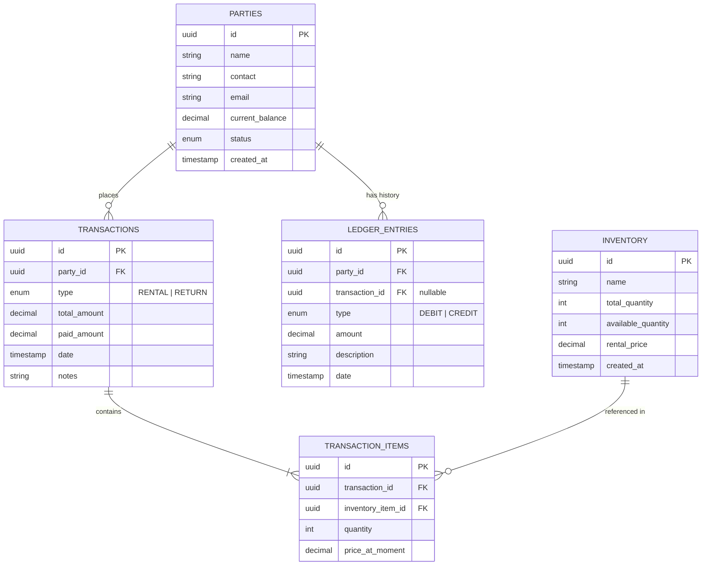

# RentalPro Database Schema (ER Model)

## Overview

This schema is designed to handle the core business logic of a rental inventory system. It uses a **relational model** to ensure data integrity between Customers (Parties), Stock (Inventory), and Financials (Transactions/Ledger).

## Entity Relationship Diagram (ERD)

---

## Table Definitions

### 1. `parties`

Stores customer information and their current financial standing.

- **`id`** (UUID, PK): Unique identifier.
- **`name`** (VARCHAR): Client name.
- **`current_balance`** (DECIMAL): Cached sum of all ledger entries. Positive = They owe us. Negative = We owe them (Credit).
- **`status`** (ENUM): `'active'`, `'payment_due'`, `'banned'`.

### 2. `inventory`

Manages global stock levels.

- **`id`** (UUID, PK): Unique identifier.
- **`total_quantity`** (INT): The physical number of items we own.
- **`available_quantity`** (INT): `total_quantity` minus items currently out on rent.
- **`rental_price`** (DECIMAL): Standard price per unit.

### 3. `transactions`

The master record for any event (Rent or Return).

- **`id`** (UUID, PK): Unique identifier.
- **`party_id`** (UUID, FK): Who is this transaction for?
- **`type`** (ENUM): `'RENTAL'` or `'RETURN'`.
- **`total_amount`** (DECIMAL): Calculated value of the items (`qty * price`).
- **`paid_amount`** (DECIMAL): How much cash/transfer was received at this exact moment.

### 4. `transaction_items`

Detail table linking Transactions to Inventory. Handles the "Many-to-Many" relationship.

- **`transaction_id`** (UUID, FK): Link to parent transaction.
- **`inventory_item_id`** (UUID, FK): Link to item.
- **`quantity`** (INT): Number of items rented or returned.
- **`price_at_moment`** (DECIMAL): We save the price _at the time of rental_ in case the main `inventory` price changes later.

### 5. `ledger_entries` (Audit Log)

_Advanced Concept_: Instead of just trusting `current_balance`, we record every financial movement. The `current_balance` in the `Parties` table is just the sum of these rows.

- **`party_id`** (UUID, FK)
- **`amount`** (DECIMAL): The value change.
- **`type`** (ENUM):
  - `'DEBIT'` (Rental Charge - Increases Balance)
  - `'CREDIT'` (Payment/Return Value - Decreases Balance)
- **`reference_id`**: Could point to a Transaction ID or be null (for manual adjustments).

---

## Business Logic Examples

### A. Rental Logic (SQL Transaction)

When a user submits a **Rental**:

1.  **Insert** into `transactions` (Type: 'RENTAL').
2.  **Insert** items into `transaction_items`.
3.  **Update** `inventory`: Decrease `available_quantity`.
4.  **Insert** into `ledger_entries`: Debit amount (Total Cost) to increase debt.
5.  **Insert** into `ledger_entries`: Credit amount (Paid Amount) to decrease debt (payment received).
6.  **Update** `parties`: Set `current_balance = current_balance + (Total - Paid)`.

### B. Return Logic

When a user submits a **Return**:

1.  **Insert** into `transactions` (Type: 'RETURN').
2.  **Insert** items into `transaction_items`.
3.  **Update** `inventory`: Increase `available_quantity`.
4.  **Insert** into `ledger_entries`: Credit amount (if return implies refund or debt reduction).
5.  **Update** `parties`: Update balance.
